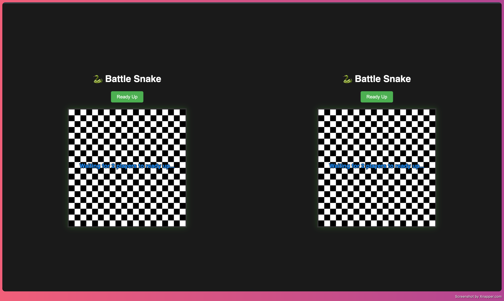
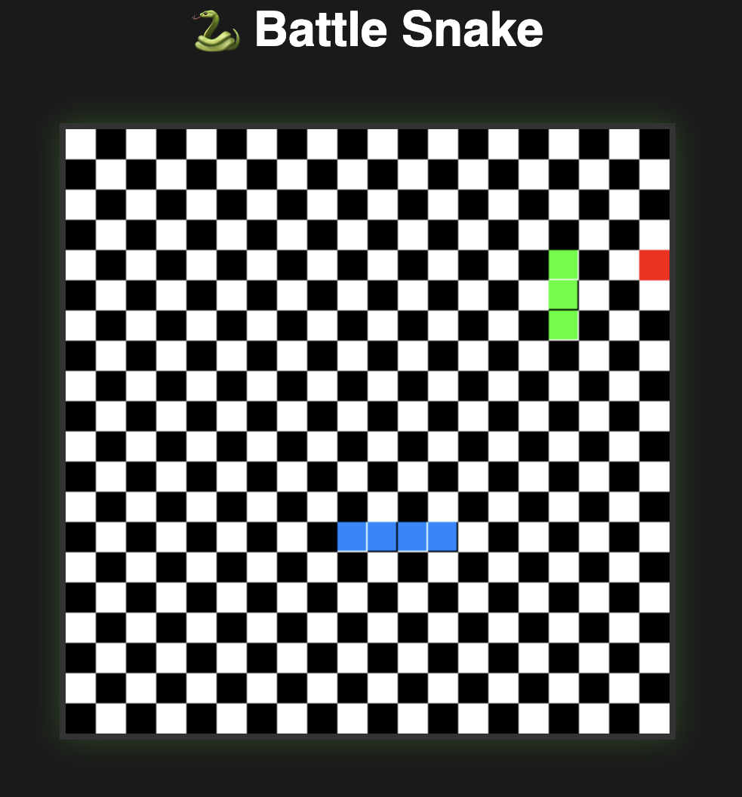
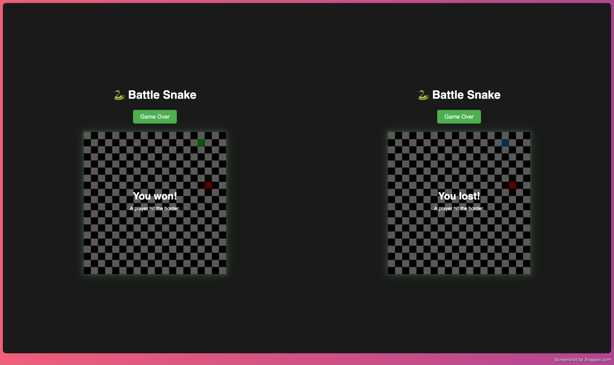

# Battle Snake

Two-player real-time Snake game built with TypeScript and Socket.IO.

This project demonstrates multiplayer state synchronization, a server-authoritative game loop, collision handling, and win/lose game states.

## Demo
Lobby and Ready Up state before the round starts:





Live game with two players, apple collection, and movement:




Round result view with You won / You lost messaging:




## Features

- 2-player Ready Up lobby flow
- Server-authoritative game tick loop
- Real-time movement with Socket.IO
- Apple collection with snake growth
- Win conditions:
  - Border collision defeat
  - First player to 10 apples wins
- Client-specific game-over messaging
- Grid-based canvas rendering

## Tech Stack

- TypeScript
- Node.js
- Express
- Socket.IO
- Vite
- HTML5 Canvas

## Architecture Overview

- The server owns the source of truth for game state.
- Clients only send direction input events.
- The server updates state on each tick and broadcasts to both clients.
- Clients render frames from broadcasted state.

## Local Setup

1. Install dependencies from project root:

```bash
npm install
```

2. Start server:

```bash
cd server
npx tsx index.ts
```

3. Start client in a second terminal window:

```bash
cd client
npx vite
```

4. Open two browser tabs at the client URL and press Ready Up in both tabs.

## Controls

- Arrow keys
- WASD

## Rules

- Stay inside the board.
- Collect apples to grow.
- First to 10 apples wins.
- Hitting the border ends the round.

## What I Learned

- Designing multiplayer game state with server authority
- Managing real-time events and synchronization between clients
- Building deterministic rendering from shared state updates

## TODOS:

- Snake-to-snake collision rules
- Play Again flow without restarting server
- Public online deployment
